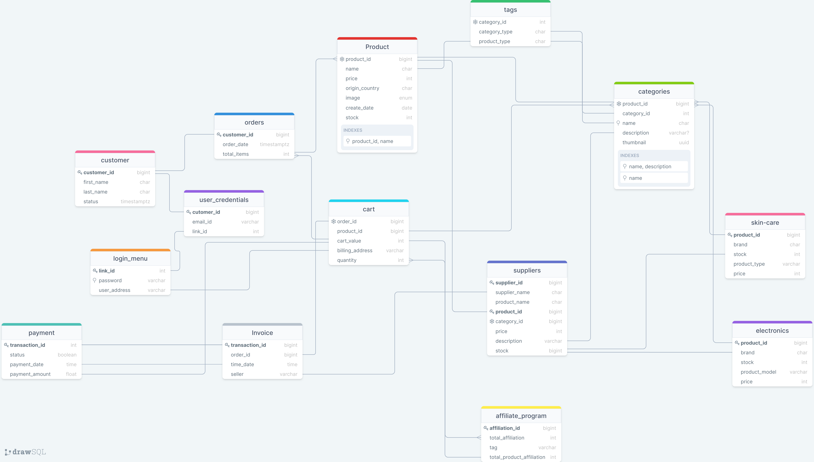

# ecommerce-schema
Database schema for E commerce site/App.

## Description
This diagram is general representation of Database structure and components for real-world e-commerce application.

Diagram(layout of database) was created using [drawSQL](https://drawsql.app/).

PostgreSQL database diagram in a .sql file can be found [here](./pgsql-export.sql).

## Diagram

## What is Ecommerce?
Ecommerce, also known as electronic commerce or internet commerce, refers to the buying and selling of goods or services using the internet, and the transfer of money and data to execute these transactions.
